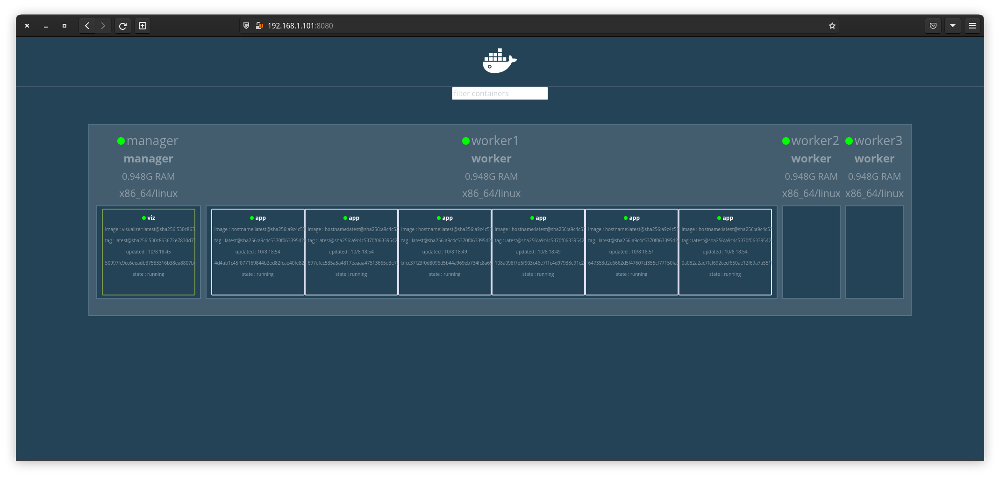
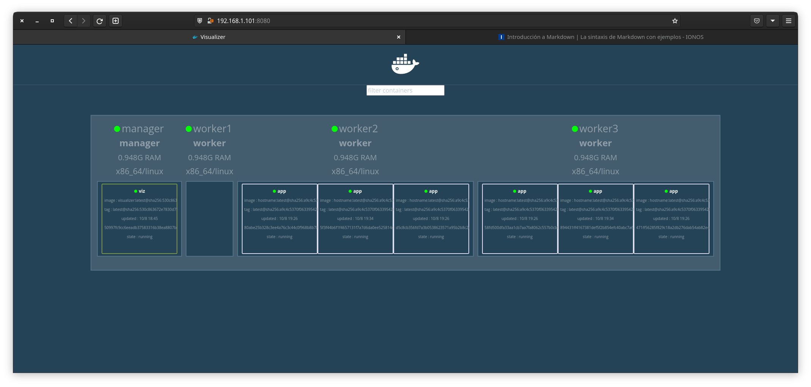
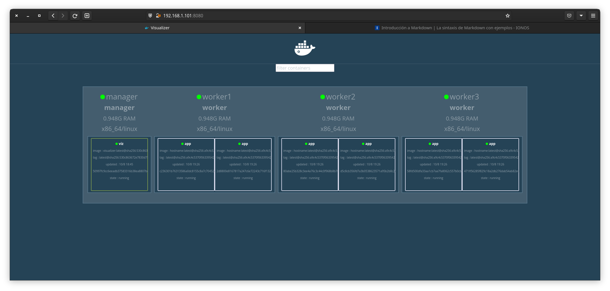

# Docker Swarm 🐳

Docker Swarm es una solución para balancear la carga automáticamente. La solucón de clustering nativa que ofrece Docker para que nosotros, administradores y desarrolladores solo vean un Docker deamon.

Para ejecutar aplicaciones productivas, esta aplicación tiene que estar lista para poder servir a los usuarios en todo momento, a pesar de situaciones catastroficas o de alta demanda.

## Escalabilidad

La capacidad de aumentar la potencia de computo a medida que la demanda avanza.

### Escalabilidad vertical

Más hardware, donde sí hay límite físico.

### Escalabilidad horizontal

Distribuir esta carga entre diferentes ordenadores. Esta es la más usada.

### Disponibilidad

Es la capacidad de una aplicación o servicio para poder estar siempre disponible. Prevée problemas con servidores que fallen, etc...

La escabilidad horizontal y la disponibilidad van de la mano.

## Arquitectura

Docker Swarm plantea un esquema de dos tipos de máquinas:

### Manager Nodes

Son aquellos que se encargan de Administrar el Swarm el clúster de máquinas en si, donde vigila donde hay recursos para garantizar la disponibilidad.

Si hay alguna catástrofe en un servidor, este se tiene que encargar de volver a distribuir la carga entre los Worker Nodes restantes.

### Worker Nodes

Són más que los managers, aquí se ejecutarán los contenedores y son el núcleo de la aplicación productiva. Los únicos requisitos para configurarlos serán:

* Tener el Docker Deamon instalado, idealmente con la misma versión.
* Deben estar todos en la misma red.

Debemos saber si nuestras aplicaciones están listas para correr en Docker Swarm.

## Requisitos de la aplicación

Los requisitos para poder ejecutar nuestras aplicaciones deberian de ser:

* Codebase: Tú aplicación tiene que estár versionado. Por ejemplo. Git, SVM, etc...

* Dependencias: Tienen que estar declaradas y empaquetadas.

* Configuración: Mismo código para todas en el mismo lugar.

* Backing services: Deben estar apuntando a servicios. No tiene que estar en la misma aplicación.

* Build, Release, Run: Deben estar bien definidas en el workflow.

* Processes: La aplicación se tiene que ejecutar como un proceso stayless, no puede esperar cierto estado, todo se debe de realizar de forma atómica.

* Port binding: Las aplicaciones se tienen que exponer directamente a través de un puerto en la máquina que están corriendo, sin intermediarlos.

* Concurrencia: La aplicación tiene la capacidad de correr diferentes instancias en paralelo.

* Disposability: La aplicación tiene que estar diseñada para ser facilmente destruible.

* Dev/Prod parity: Lograr que nuestro entorno de desarrollo sea lo más parecido a producción.

* Logs: Todos los logs deben tratarso como un flujo de device. Tiene que cumplir el Standard Output.

* Admin processes: La aplicación debe poder ejecutar procesos como independientes.

## Comandos iniciales

Para poder iniciar el Swarm de Docker, donde iniciará nuestro nodo como un Manager:

```bash
docker swarm init
```

Para poder añadir un Worker Node, deberemos ejecutar:

```bash
docker swarm join --token <token> <worker_ip>:<worker_port>

# Ejemplo

docker swarm join --token <token> 127.0.0.1:2377
```

Para añadir Manager Nodes, deberemos ejecutar:

```bash
docker swarm join-token manager

# Este comando nos mostrará el comando a ejecutar, con el tocken correspondiente. 

docker swarm join --token <token> <manager_ip>:<manager_port>
```

Para poder listar nuestros nodos, donde nos mostrará el ID de este nodo, hostname, estado, disponibilidad, tipo de manager y la versión del Docker deamon; tendremos que ejecutar:

```bash
docker node ls
```

Para poder inspeccionar la configuración del nodo, deberemos de ejecutar:

```bash
docker node inspect <ID/self>

docker node inspect --pretty self

# En este caso, deberemos de poner el ID del nodo. Si por ejemplo ya estamos en una conexión SSH dentro del nodo a administrar, podemos especificar *self* para indicar el mismo nodo

# La flag *--pretty* se utiliza para imprimir la información estructurada. Esta opción puede llegar a ocultar información.
```

Para abandonar el Swarm

```bash
docker swarm leave

# Si aparece el siguiente error, significa que estamos intentando salir como nodo Manager.

# Error response from daemon: You are attempting to leave the swarm on a node that is participating as a manager. Removing the last manager erases all current state of the swarm. Use `--force` to ignore this message.

# Para forzar la salida de este swarm, añadiremos el flag *--force*.

docker swarm leave -f

# Node left the swarm.
```

Si un Worker Node se va de un Swarm, los Manager Node los pondrán a correr en otros Worker Node. Si se va un Manager Node, hay riesgo de perder y sea irrecuperable el propio Swarm.

Para poder ver el estado de Swarm, si está inactivo o no, podemos ejecutar el siguiente comando:

```bash
docker info | grep Swarm

#  Swarm: active
```

## Fundamentos de Docker Swarm

### Servicios

En Swarm no se corren contenedores manualmente, se declaran los servicios que se desean correr.

Para crear un servicio, se deberá de ejecutar de la siguiente manera el la terminal

```bash
docker service create --name <name> <image> <command>

# Ejemplo

docker service create --name pinger alpine ping www.google.com

## Alpine es una distribución Linux muy ligera orientada a la seguridad.
```

Para poder ver los servicios que están corriendo, debemos ejecutar este otro comando:

```bash
docker service ls
```

#### Ciclo de vida

Desde el cliente, *docker service create* le envía al Manager Node el servicio: se crea, verifica cuantas tareas tendrá, se le otorga una dirección IP virtual y asigna la tarea a los nodos; esta información es recibida por los Worker Node, que es quien prepara la tarea y seguidamente ejecuta los contenedores.
Para poder ver estos servicios, se deberá de ejecutar:

```bash
docker service ps <service_name>

# Ejemplo

docker service ps pinger
```

Para poder inspeccionar el servicio, podemos ejecutar:

```bash
docker service inspect <service_name>

# Ejemplo

docker service inspect pinger
```

Para ver los logs de un servicio, se puede ejecutar:

```bash
docker service logs <service_name> -f

# Ejemplo

docker service logs pinger -f

## La opción *-f* se utiliza para hacer *follow* a dichos logs
```

Para poder borrar el servicio, se utiliza:

```bash
docker service rm <service_name>

# Ejemplo

docker service rm pinger

## Este comando elimina el servicio, pero el contenedor lo deja ejecutando durante unos segundos más.
```

#### Administración

Para poder escalar y administrar los servicios entre diferentes nodos, se utiliza:

```bash
docker service scale <service_name>=<number_of_replicas>

# Ejemplo

docker service scale pinger=5

# o

docker service update --replicas=<number_of_replicas> <service_name>

# Ejemplo

docker service update --replicas=20 pinger
```

Para poder actualizar en caliente un servicio, cambiar su configuración, donde su imagen es parte de su configuración, ejecutamos:

```bash
docker service update --args <new_arguments> <service>

# Ejemplo

docker service update --args "ping www.amazon.com" pinger
```

Para poder volver a la versión anterior del servicio, deberemos usar:

```bash
docker service rollback <service>

# Ejemplo

docker service rollback pinger
```

Cuando ejecutamos *docker service inspect <service_name>*, en el apartado de *UpdateConfig* y *RollbackConfig*, nos encontraremos algo como lo que nos aparece en el siguiente texto:

```json
            "UpdateConfig": {
                "Parallelism": 1, // Indica cuantos contenedores puede hacer a la vez
                "FailureAction": "pause", // Indica las acciones que hará si la acción falla.
                "Monitor": 5000000000, // Indica la ventana de tiempo, en nanosegundos, que queremos dar al Docker Swarm para determinar si falla o no.
                "MaxFailureRatio": 0, // Indica el % de tareas, cuando falla, que quiero actualizar considero un fallo y hago un rollback. 
                "Order": "stop-first" // Indica que hacer, el orden en el que se ejecuta.
                // Si este apartado se encuentra en stop-first, primero destruirá el contenedor y lo volverá a crear
                // Si se encuentra en start-first, primero creará un nuevo contenedor y elimina el antiguo
            },
            "RollbackConfig": {
                "Parallelism": 1,
                "FailureAction": "pause",
                "Monitor": 5000000000,
                "MaxFailureRatio": 0,
                "Order": "stop-first"
            },

```

Para poder actualizar diferentes apartados, podemos utilizar estas flags:

```bash
docker service update --update-parallelism 4 --update-order start-first --update-failure-action rollback --update-max-failure-ratio 0.5 pinger
```

Con estos cambios, esta configuración quedará de la siguiente manera:

```json
            "UpdateConfig": {
                "Parallelism": 4,
                "FailureAction": "rollback",
                "Monitor": 5000000000,
                "MaxFailureRatio": 0.5,
                "Order": "start-first"
            },
```

Para cambiar la configuración de *RollbackConfig*

```bash
docker service update --rollback-parallelism 0 --rollback-order start-first pinger
```

Con esta última actualización, deberemos de tener *inspect* del servicio de esta manera:

```json
"RollbackConfig": {
                "Parallelism": 0,
                "FailureAction": "pause",
                "Monitor": 5000000000,
                "MaxFailureRatio": 0,
                "Order": "start-first"
            },
```

## Servicios reales

Para poder ejecutar una aplicación productiva en contenedores, lo primero que deberemos de hacer es subirla a nuestro repositorio en la nube. En este caso nosotros usamos Docker Hub.

Lo primero que deberemos hacer es crear nuestra imager con el Dockerfile, así la dejaremos lista para subirla:

```bash
docker build -t <username>/<image> .
```

Seguidamente, procederemos a subirla al repositorio con el mismo nombre de imágen:

```bash
docker push <username>/<image>
```

Para crear el servicio en Docker Swarm, usando dicha imagen, deberemos de hacerlo de la siguiente manera:

```bash
docker service create -d --name <service_name> --publish <port_host>:<port_swarm> --replicas=<num_replicas> <username>/<image>
```

## Routing Mesh

Routing Mesh nos ayuda a que, teniendo un servicio escalado en swarm que tiene más nodos que servicios y esos servicios están expuestos a un solo puerto; cuando hacemos una petición en ese puerto, de alguna manera, la petición llega y no se pierde en algún nodo que no puede contenerlo en ese puerto o en un contenedor.

Esto ayuda a llevar la petición no se pierda y que no se pierda si la cantidad de contenedores es diferente a la cantidad de nodos.

## Restricciones de despliegue

Para que nuestros servicios solo se puedan ejecutar en nodos de dichos roles, managers o workers, deberemos de especificarlo actualizando el servicio o cuando creamos dicho servicio:

En el siguiente ejemplo, podemos ver como podemos crear el servicio *viz*. Este servicio, contendrá la imagen *dockersamples/visualizer* para poder controlar nuestro docker swarm visualmente. Este servicio, tal y como se especifica en el *node.role* solamente lo podrán ejecutar los que tengan el rol de *manager*. También, para que pueda mostrar correctamente esta interfaz, tendremos que agregarle el Sock de Docker.

```bash
docker service create -d --name viz -p 8080:8080 --constraint=node.role==manager --mount=type=bind,src=/var/run/docker.sock,dst=/var/run/docker.sock dockersamples/visualizer
```



Para actualizar nuestro servicio *app* para que pueda ejecutarse solamente en nodos con rol **worker**, también deberemos especificarlo.

```bash
docker service update --constraint-add node.role==worker --update-parallelism=0 app
```

## Disponibilidad de los nodos

En este ejemplo, queremos hacer mantenimiento en el Worker 1. En el Worker 1 debemos de drenar o apagar todos los contendores de dicho Worker, así que los tenemos que pasar a los demás.

```bash
docker node update --availability drain worker1
```

Una vez acabado el mantenimiento, volveremos a poner el Worker 1 para que esté activo:

```bash
docker node update --availability active worker1
```



El problema que presentamos ahora, es que no se encienden los contenedores de Worker 1, solo están en Worker 2 y 3. Para que vuelvan también al Worker 1, deberemos de forzar la actualización del servicio para que tenga que replanificar. Para lograrlo podemos hacerlo de dos maneras:

```bash
docker service update -d --env-add UNA_VARIABLE=de-entorno app

# O

docker service update app --force
```



## Redes y Service Discovery

Cuando tenemos un Docker Swarm, tenemos que tener presente que creará 2 redes adicionales por defecto; estas redes serán: *docker_gwbridge* y *ingress*. Este útlimo es más especifico a Swarm, donde tiene el driver *overlay* y Scope *swarm*, para interconectar servicios.

```text
NETWORK ID     NAME              DRIVER    SCOPE
9d3968cd08c7   docker_gwbridge   bridge    local
tiycl7teixjz   ingress           overlay   swarm
```

Para crear una red overlay, solamente tendremos que coger el comando interno de Docker añadiendo la flag *--driver* con el parámetro *overlay*:

```bash
docker network create --driver overlay <network_name>

# Ejemplo

docker network create --driver overlay app-net
```

Como ejemplo, hemos utilizado una aplicación donde está alojada en *alexis900/networking* junto a la imágen de Mongo:

```bash
docker build -t alexis900/networking .
docker push alexis900/networking
docker service create -d --name db --network app-net mongo
docker service create -d --name app --network app-net -p 3000:3000 alexis900/networking
docker service update --env-add MONGO_URL=mongodb://db/test app
```

## Docker Swarm Stack

Los Docker Swarm Stacks es un fichero para controlar cómo se van a desplegar los servicios utilizando los stacks. Son muy parecidos a los ficheros Docker Compse.

```yaml
version: "3"

services:
  app:
    image: gvilarino/swarm-networking
    environment:
      MONGO_URL: "mongodb://db:27017/test"
    depends_on:
      - db
    ports:
      - "3000:3000"

  db:
    image: mongo
```

Para correr con Docker Swarm utilizamos *docker stack* de la siguiente manera:

```bash
docker stack deploy --compose-file stackfile.yml app
```

En la configuración del servicio podemos añadir el parámetro de Deploy / Placement / Constraints, donde se puede especificar los diferentes parámetros que usabamos anteriormente para indicar el worker. Este podrá ser utilizado para Docker Compose, exceptuando esta opción de Deploy.

```yaml
    deploy:
      placement:
        constraints: [node.role==worker]
```

Para poder listar los Stacks, utilitzaremos el siguiente comando:

```bash
docker stack ls
```

Para eliminar el Stack, deberemos de usar este otro comando:

```bash
docker stack rm app
```